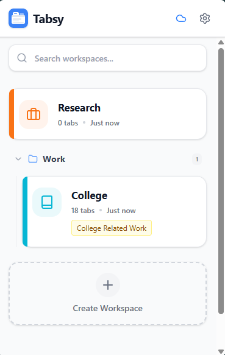
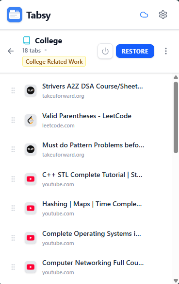
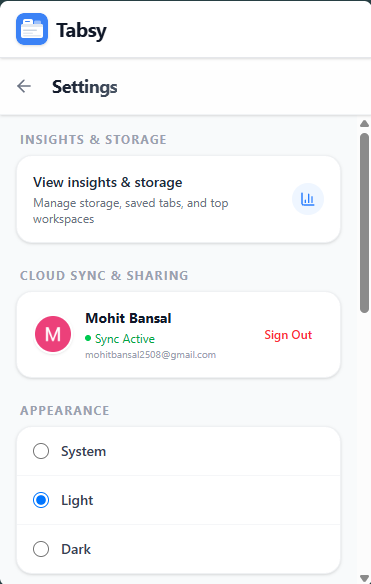

<div align="center">
  

  <h1>Tabsy</h1>

  <p><strong>Your tabs. Your worlds. Zero chaos.</strong></p>
  <p>A beautiful, lightning-fast Chrome Manifest&nbsp;V3 Side Panel extension for organizing browser tabs into distinct, syncable workspaces.</p>

  <p>
    
    
    
    
    
  </p>

  <p>
    <a href="#-features">Features</a> •
    <a href="#-interface">Interface</a> •
    <a href="#-getting-started">Getting Started</a> •
    <a href="#%EF%B8%8F-cloud-sync--firebase-setup">Cloud Sync</a> •
    <a href="#-tech-stack">Tech Stack</a> •
    <a href="#-privacy-first">Privacy</a> •
    <a href="#-version-history">Version History</a>
  </p>
</div>

<br/>

<div align="center">
  <sub>Stash a hundred tabs. Restore your entire context in one click. Never lose your place again.</sub>
</div>

---

## ✨ Features

<table>
<tr>
<td width="50%" valign="top">

### 🗂️ Organize
- **Smart Workspaces** — group open tabs into isolated, named workspaces
- **Workspace Groups & Folders** — collapsible folders for large collections
- **Native Chrome Tab Groups** — full names, colors, and structure preserved
- **Workspace & Tab Annotations** — attach notes to document your research
- **Advanced Pinned Tab Support** — pinned state tracked, badged, and restored

</td>
<td width="50%" valign="top">

### ⚡ Move Fast
- **Live Auto-Sync** — a workspace that tracks your tabs in real time
- **Drag-and-Drop Reordering** — buttery-smooth tab reordering
- **Global Deep Search** — find any tab title or URL across every workspace
- **Keyboard-First Navigation** — arrow keys and Enter, no mouse required
- **Advanced Restore Modes** — add to window, or replace it for a clean switch

</td>
</tr>
<tr>
<td width="50%" valign="top">

### ☁️ Sync & Share  <sub>`v1.4`</sub>
- **Cross-Device Cloud Sync** — sign in with Google, sync in real time
- **Share via Link** — a secure 6-character code shares any workspace instantly
- **Insights & Analytics** — visual charts of usage, tab counts, top categories
- **Seamless Import Flow** — paste a share ID to pull a workspace down instantly

</td>
<td width="50%" valign="top">

### 🛡️ Stay Safe
- **Undo Accidental Deletes** — instant Undo toast, backed by a 10-item trash
- **Duplicate Tab Management** — find and clean identical tabs across workspaces
- **Selective Export & Import** — back up exactly the workspaces you choose
- **Bulk Actions** — multi-select to manage or delete many tabs at once

</td>
</tr>
</table>

**Plus:** 27 premium Lucide icons and 18 modern color swatches for every workspace, a dynamic tab-count badge on the extension icon, and gorgeous Dark/Light themes that follow your OS or toggle manually.

---

## 🎨 Interface

Tabsy is built with **React**, **Tailwind CSS**, and **Lucide Icons** to feel premium and buttery-smooth: soft shadows, dynamic hover states, collapsible folders, live search results, and floating modals — all hyper-optimized for the narrow Side Panel format.

<p align="center">
  
  
  
</p>

---

## 🚀 Getting Started

### Prerequisites

| Requirement | Version |
|---|---|
| Node.js | v18+ |
| Package manager | npm or yarn |

### Installation

```bash
# 1. Clone the repository
git clone https://github.com/yourusername/tabsy.git
cd tabsy

# 2. Install dependencies
npm install

# 3. Build the extension
npm run build
```

> The build step automatically generates all required extension icons from the source SVG — no manual asset prep needed.

### Loading into Chrome

1. Open Chrome and navigate to `chrome://extensions/`.
2. Turn on **Developer mode** (top right corner).
3. Click **Load unpacked** and select the generated `dist` folder.
4. Pin the extension to your toolbar and click the icon to open the Side Panel. 🎉

---

## ☁️ Cloud Sync & Firebase Setup

Tabsy works fully offline out of the box, using Chrome's local storage. Enabling **Cross-Device Sync** and **Link Sharing** takes three steps.

<details>
<summary><strong>1. Firebase Setup</strong></summary>
<br/>

1. Go to the [Firebase Console](https://console.firebase.google.com/) and create a new project.
2. Add a **Web App** to your project.
3. Copy the provided configuration (`apiKey`, `authDomain`, `projectId`, etc.).
4. In your local Tabsy repository, rename `.env.example` to `.env` and fill in your Firebase configuration variables.

</details>

<details>
<summary><strong>2. Firestore Database Rules</strong></summary>
<br/>

Enable **Firestore Database** in Firebase and deploy these security rules to protect user data and manage shared workspace links:

```javascript
rules_version = '2';
service cloud.firestore {
  match /databases/{database}/documents {
    match /users/{userId}/workspaces/{workspaceId} {
      allow read, write: if request.auth != null && request.auth.uid == userId;
    }
    match /shared_workspaces/{shareId} {
      allow read: if true;
      allow create: if request.auth != null;
      allow update, delete: if false;
    }
  }
}
```

</details>

<details>
<summary><strong>3. Google Cloud Console (OAuth)</strong></summary>
<br/>

To let users sign in with Google via the Chrome Identity API, whitelist your extension's ID:

1. Find your Tabsy Extension ID in `chrome://extensions/` (e.g. `cghnoiadbjpheclgeanjonkbdffeakei`).
2. Go to [Google Cloud Console → Credentials](https://console.cloud.google.com/apis/credentials).
3. Click **Create Credentials → OAuth client ID**.
4. Set Application Type to **Chrome app**.
5. Paste your Extension ID into the Application ID field.
6. Copy the generated **Client ID**.
7. Open `public/manifest.json` and paste your Client ID under `oauth2 → client_id`.

</details>

Rebuild the project (`npm run build`), reload the extension, and Cloud Sync is fully operational. ✅

---

## 🛠️ Tech Stack

| Layer | Technology |
|---|---|
| Platform | Chrome Extensions API (Manifest V3) |
| UI | React 19 · TypeScript · Tailwind CSS V4 |
| Build | Vite + `@crxjs/vite-plugin` (HMR) |
| Backend | Firebase (Auth & Firestore) |
| Icons | Lucide React |
| Charts | Recharts |
| Drag & Drop | dnd-kit |

---

## 🔒 Privacy First

Tabsy puts you in control of your own data.

- **Local by default** — if you never sign in, Tabsy runs entirely locally; your tabs never leave your machine.
- **Secure cloud, when you opt in** — Sync data lives in your own private Firebase Firestore instance behind strict, user-isolated security rules.
- **No analytics tracking** — no third-party analytics, no browsing-activity tracking, ever.

---

## 📜 Version History

| Version | Highlights |
|---|---|
| **v1.4** | Cloud Sync, Share via Link, Insights & Analytics dashboard |
| **v1.3** | Native Chrome Tab Groups, Duplicate Tab Manager, keyboard navigation, annotations |
| **v1.2** | Workspace folders, Undo deletes, Global Deep Search, advanced restore modes |
| **v1.1** | Auto-sync, drag-and-drop reordering, pinned tab support, bulk actions |
| **v1.0** | Core workspace management, tab restoration, JSON export/import, theming |

---

<div align="center">
  <p>Built with ❤️ for people with too many tabs open.</p>
  <p><sub>Version 1.4.0</sub></p>
</div>